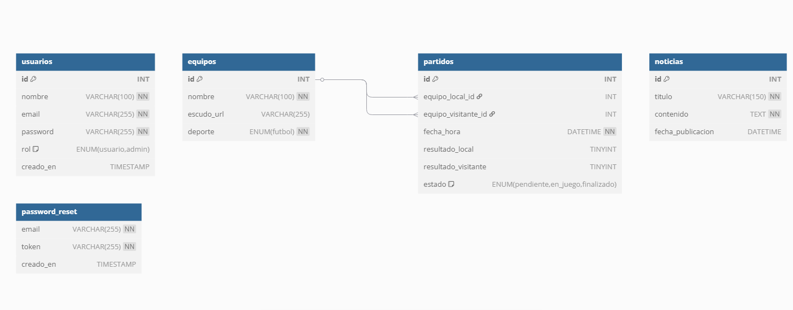

## LiveScore

**LiveScore** es una pagina web que ofrece resultados deportivos de la Liga Española, información de equipos españoles, goleadores y noticias actualizadas. 

Ofrece una **funcionalidad innovadora** que permite al usuario **crear su propio once ideal** de cualquier equipo, seleccionando a los jugadores sobre un campo de fútbol en formación 4-3-3.

## APIs utilizadas

LiveScore obtiene sus datos en tiempo real a través de tres APIs principales:

- **[Football-Data.org](https://www.football-data.org/)**: API gratuita que proporciona información básica como equipos (nombre y escudo), tabla de clasificación de La Liga y máximos goleadores.

- **[Transfermarkt API](https://transfermarkt-api.fly.dev/)**: API no oficial que ofrece información muy detallada sobre clubes, jugadores, plantillas, biografías, estadísticas, historial de lesiones, logros, escudos históricos, entre otros. Al ser una API gratuita y no oficial, presenta errores de servidor ocasionales.

- **[GNews](https://gnews.io/)**: API de noticias utilizada para mostrar artículos relacionados con el fútbol español. El plan gratuito permite 100 solicitudes al día.

## 🛠️ Tecnologías utilizadas

<div align="center">

<table>
  <tr>
    <td align="center" width="140">
      
      <strong>Laravel 11</strong>
    </td>
    <td align="center" width="140">
      <br>
      <strong>PHP 8+</strong>
    </td>
    <td align="center" width="140">
      <br>
      <strong>MySQL</strong>
    </td>
    <td align="center" width="140">
      <br>
      <strong>Bootstrap 5</strong>
    </td>
  </tr>
  <tr>
    <td align="center" width="140">
      <br>
      <strong>JavaScript ES6</strong>
    </td>
    <td align="center" width="140">
      <br>
      <strong>CSS3</strong>
    </td>
    <td align="center" width="140">
      <br>
      <strong>HTML5</strong>
    </td>
    <td align="center" width="140">
      <br>
      <strong>Git</strong>
    </td>
  </tr>
</table>

</div>

</div>


## 🌟 Características principales

- 🏟️ Resultados en directo de La Liga
- 📊 Clasificación general y máximos goleadores
- 🧠 Información detallada de jugadores (biografía, estadísticas, lesiones, logros)
- 👥 Sistema de equipos favoritos por usuario
- 🎯 Personalización del once ideal por cada equipo
- 👤 Perfil con edición de datos, cambio de contraseña, etc.
- 🛡️ Sistema de roles (admin/usuario)
- 👨‍💼 El administrador puede ver a todos los usuarios, editar sus perfiles y eliminar sus equipos favoritos
- 📰 Noticias actualizadas sobre fútbol español

  
## Estructura de la base de datos




## 🚀 Instalación y ejecución

```bash
# 1. Clona el repositorio
git clone https://github.com/cristobaltt7/LiveScore.git
cd LiveScore

# 2. Instala las dependencias
composer install
npm install && npm run dev

# 3. Crea y configura el archivo .env
cp .env.example .env
# Luego edita .env con tus datos (DB, claves API, etc.)

# 4. Genera clave y migra la base de datos
php artisan key:generate
php artisan migrate

# 5. Inicia el servidor
php artisan serve
